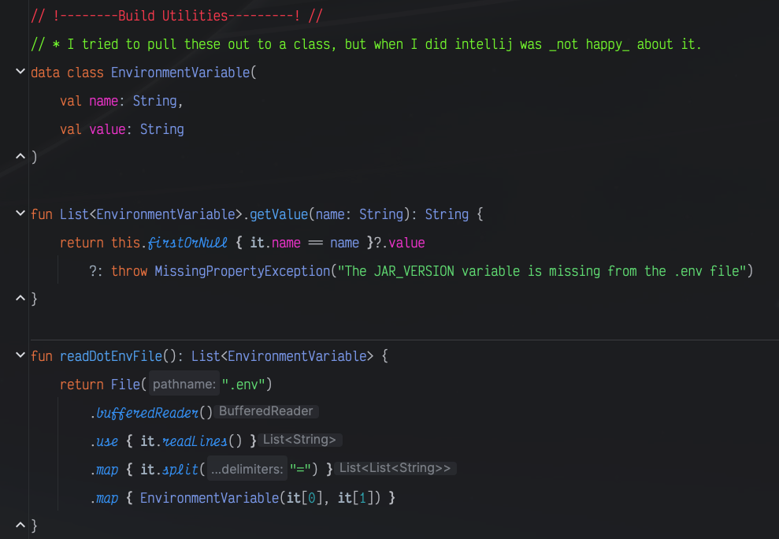

# Matrix Animator API

## Overview

The matrix animator API is the backend that drives (will drive) an animation builder front end and the relay of
animations down to a couple of physical LED matrices I built.

More details to come, but for historic reference this is a second try at the API that will back:

- The [matrix-animator-client](https://github.com/chris-schmitz/matrix-animator-client), a vuejs client
- The [matrix-pattern-runner](https://github.com/chris-schmitz/matrix-pattern-runner) microcontroller project

I'll be rebuilding both of those projects from the ground up most likely, but I figured I'd start with the portion that
doesn't have a janky-but-functional version first.

I'm building this partially as a fun project for my kids so they can draw their own animations on each of their LED
matrices but also as an innovation project used to better explore a bunch of the tools I use at work currently.

## Prerequisites

To use this project you'll need:

- An IDE for building java/kotlin projects like [Intellij](https://www.jetbrains.com/idea/download/?section=mac)
    - Note that whatever IDE you're using needs Kotlin support. Intellij comes with Kotlin bundled
- Java version 17 installed
- Docker

## Up and running

To get the project up and running:

```shell
# Pull down the project for the first time
git clone git@github.com:chris-schmitz/matrix-animator-api-2.git
cd matrix-animator-api-2

# To list all of the gradle tasks, including the ones custom to this project:
./gradlew tasks --all

# To launch a local instance of the project (note this will launch detached):
./gradlew dockerComposeUp

# To rebuild the jar and relaunch an already running list of services:
./gradlew dockerComposeReload

# To stop the local instance of the project:
./gradlew dockerComposeDown

# To run the tests in gradle (though really it's nicer if you run them in Intellij):
./gradlew clean test --info 
```

## Making HTTP calls

I've included the
file [matrix-animator-api.http](https://github.com/chris-schmitz/matrix-animator-api-2/blob/main/matrix-animator-api.http)
that outlines http calls that can be made to the API, their headers, payloads, etc. If you're using Intellij Ultimate
this file also works with intellij's built in http client :chef-kiss:.

## Details and Idiosyncrasies

Like I stated higher up, I'm using this as a project to explore different tools I use at work. Some of these I have a
decent grasp on, but some I'm still pretty green on. Because of that there are some details and idiosyncrasies that I
think are worth pointing out either because they weren't clear to me, so maybe they're not clear to you or because I'm
doing things in a particular way and I don't know if it's actually the correct way of going about it or not yet.

### Test Containers and Liquibase

I wanted to use test containers for repository and integration tests so that I could do actual database interactions.
You can find my configuration for this in
the [TestDataSourceConfiguration.kt](https://github.com/chris-schmitz/matrix-animator-api-2/blob/bc74c88ab26a736a9824704539f55d585ecf5a42/src/test/kotlin/com/lightinspiration/matrixanimatorapi/configuration/TestDataSourceConfiguration.kt)
file.

A couple of things worth noting in this file:

#### The need for a NamedParameterJdbcTemplte bean

If you have a configuration Bean that defines the creation of a `DataSource`, Springboot is smart enough to
generate  `JdbcTemplate` and `NamedParameterJdbcTemplate` class instances for you automatically. It's the reason why in
the

### Sharing variables between gradle and docker

One of the aspects of the build scripts and docker launching that I wanted to figure out was how to specify the version
naming for the built jar in the gradle.build.kts script and passing that version information along to docker so it can
use it while building the docker image for the app.

This _seemed_ like it should be easy, but I ran into snags with the
first approach where I tried to pass the version information via environment variable. I hit a frustration
wall, [outlined the snag here in a stack overflow question](https://stackoverflow.com/questions/77693066/passing-a-variable-from-a-gradle-task-to-docker-compose-yml-and-on-to-the-docker),
and then took a step back to re-examine the problem and read back through the docs for gradle and docker.

I looked back over the section of the docker docs where it talked about using a `.env` file to pass environment
variables to docker-compose.yml. From here I figured that if I put the data that needed to be shared between gradle and
docker then I could just add tooling in the gradle build script for reading in the contents of the .env file. EZright?

Well, the tooling was easy, it's just a couple of functions and a class for reading in the .env data that you can find
towards the bottom of
the [gradle.build.kts](https://github.com/chris-schmitz/matrix-animator-api-2/blob/main/build.gradle.kts) script (if I
haven't found a different way of handling it and ripped it out since).


I _did_ try to abstract this to a different kotlin file, but when I did intellij flipped out and red squiggled the
entirety of the gradle.build.kts file. My assumption is that while the build script is written in kotlin, it's not
compiled in the same way as the project (I mean it can't be considering it's defining how the project should be
compiled), so the file is consumed by gradle as a singular entity and any additional kotlin-y tooling you want need to
be in that file. So, that tooling got shoved to the bottom of the file.  
